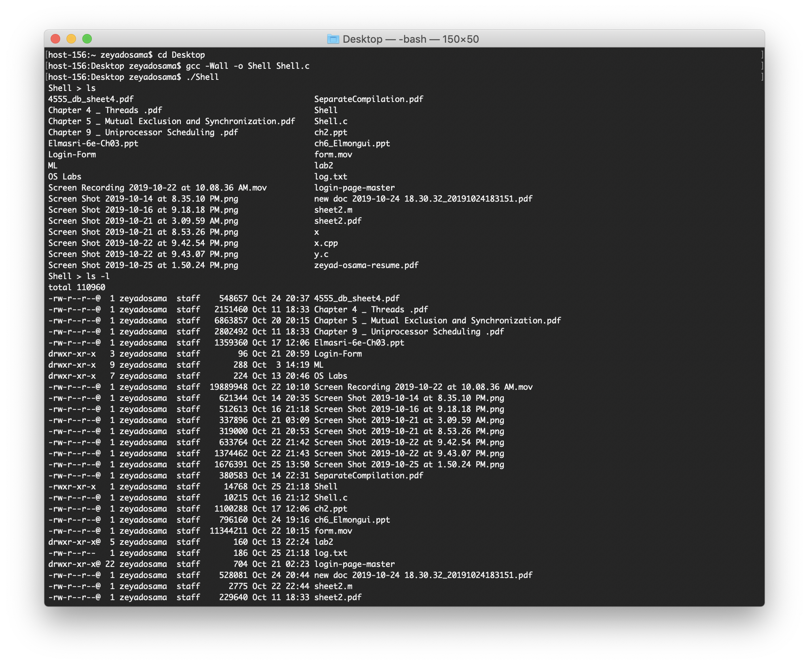
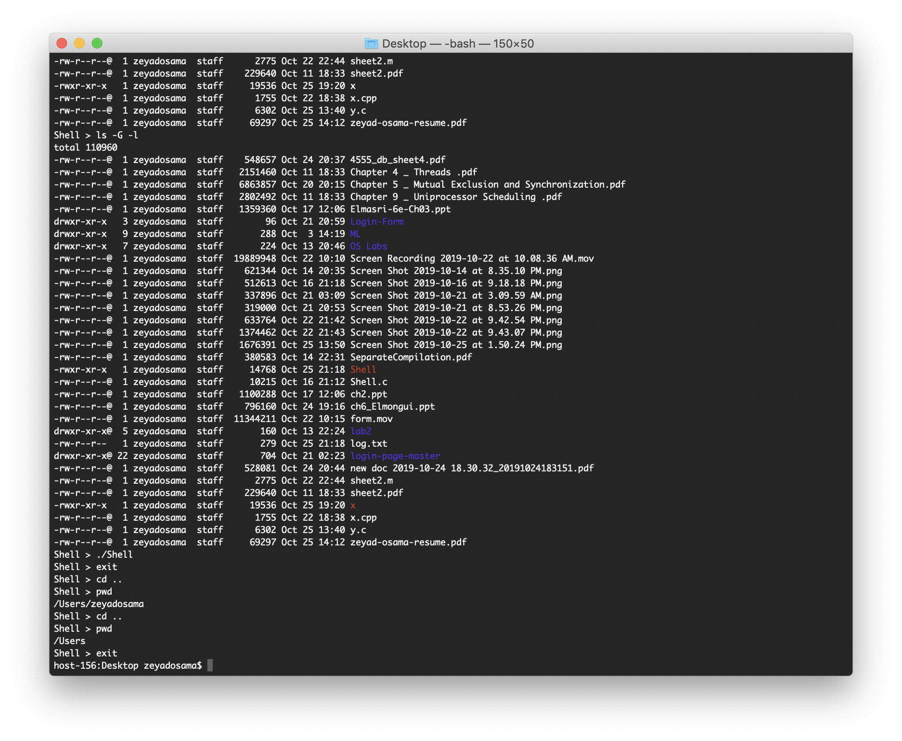
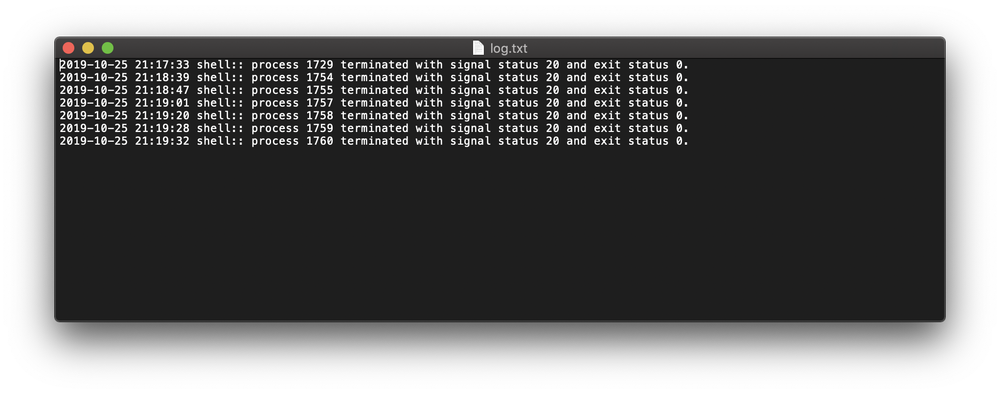

# Simple Shell
<p>
  
  
</p>
Basic Linux shell implemented with C, using basic system calls and libraries. A shell is simply a program that conveniently allows you to run other programs. Shell is an environment in which we can run our commands, programs, and shell scripts. There are different flavors of a shell, just as there are different flavors of operating systems. Each flavor of shell has its own set of recognized commands and functions.

## Features
* Executing normal Linux commands found in the PATH variable paths.
  * Commands with no arguments
  * Commands with arguments
* Background and foreground operations, echo directive.
* The internal shell command "exit" which terminates the shell
* Change directory (i.e. cd) directive.
* Logger.

## Compiling
The shell is written in one file C code. Thus, normal compiling in terminal will compile the file. For compiling use the following line:

``` c
gcc -Wall -o Shell main.c
```

## How It Works
### Lifetime & Basic Loop
A shell does three main things in its lifetime span:
* __Initialize:__ Read and execute its configuration files. 
* __Interpret:__ Reads commands from stdin and executes them.
* __Terminate:__ Execute any shutdown commands, frees up any memory and terminates.

``` c
void run(void) {
    // init
    
    // read line from terminal.

    // check running status of shell

    // check if the next execution is
    // background or foreground process.

    // deallocate
}
```

### Executing & Detecting Commands
Starting processes is the main function of shells. The fork() system call is the way for a process to get started. When this function is called, the operating system makes a duplicate of the process and starts them both running. The original process is called “parent”, and the new one is called the “child”.  fork() returns 0 to the child process, and it returns to the parent, the process ID number (PID) of its child. This means that the only way for new processes is to start is by an existing one duplicating itself.
Typically, when you want to run a new process, you don’t just want another copy of the same program, you want to run a different program. That’s what the exec() system call is all about. It replaces the current running program with an entirely new one. This means that when you call exec(), the operating system stops your process, loads up the new program, and starts that one in its place. A process never returns from an exec() call, unless there’s an error.
The parent process can continue doing other things, and it can even keep tabs on its children, using the system call wait() and that is the foreground and background concept.

``` c
int execute(char **args, bool background) {
    // initializing signal handler

    // call to execvp

    // run child process and check its state.
}
``` 

``` c
int detect_command(char **args, bool background) {
    // loop on predefined functions.

    // if one of them is detected, current function calls it.
    // otherwise, preform normal executing.
}
``` 


### Logging
Typically, at this step, all what is done is that we log the progress of the shell by logging when processes are terminated, knowing their exact time, exit status and it’s ID. 

``` c
bool write_to_file(pid_t pid, sig_atomic_t signal_status, int status) {
    // define path.

    // get current time.

    // write log file.
}
``` 

## Sample Runs





